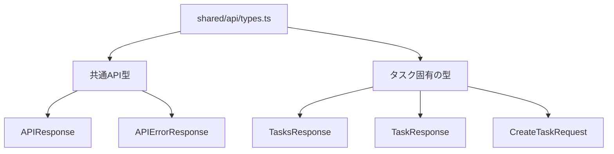

# API 型の組織化

## ステータス

提案中

## コンテキスト

現在、API のレスポンス型は以下の課題を抱えています：

1. 型の重複と分散
   - TaskAPIResponse と TasksAPIResponse が異なるファイルで定義されている
   - APIErrorResponse も複数箇所で定義されている
2. レイヤー構造の問題
   - API のレスポンス型が entities レイヤー内に存在
   - モックの型定義が独立したディレクトリにある

## 決定

Feature-Sliced Design のプラクティスに従い、API 型を以下のように再構成します：

### 実装詳細

1. `shared/api/types.ts` を作成し、以下の型を定義：
   - `APIResponse<T>`: 共通のレスポンス型
   - `APIErrorResponse`: エラーレスポンス型
   - タスク関連の型: `TasksResponse`, `TaskResponse`, `CreateTaskRequest`

2. 既存の API 関連の型を新しい場所に移行

3. API 関連のコードを更新
   - useTasks
   - useCreateTask
   - モックハンドラー

## 影響

### 肯定的な影響

- 型の一元管理による保守性の向上
- レイヤー間の責任の明確化
- API スキーマの一貫性の確保

### 否定的な影響

- 既存コードの修正が必要
- 移行作業に時間が必要

## 実装計画

1. shared/api ディレクトリの作成
2. 共通 API 型の実装
3. 既存コードの更新
4. テストの更新