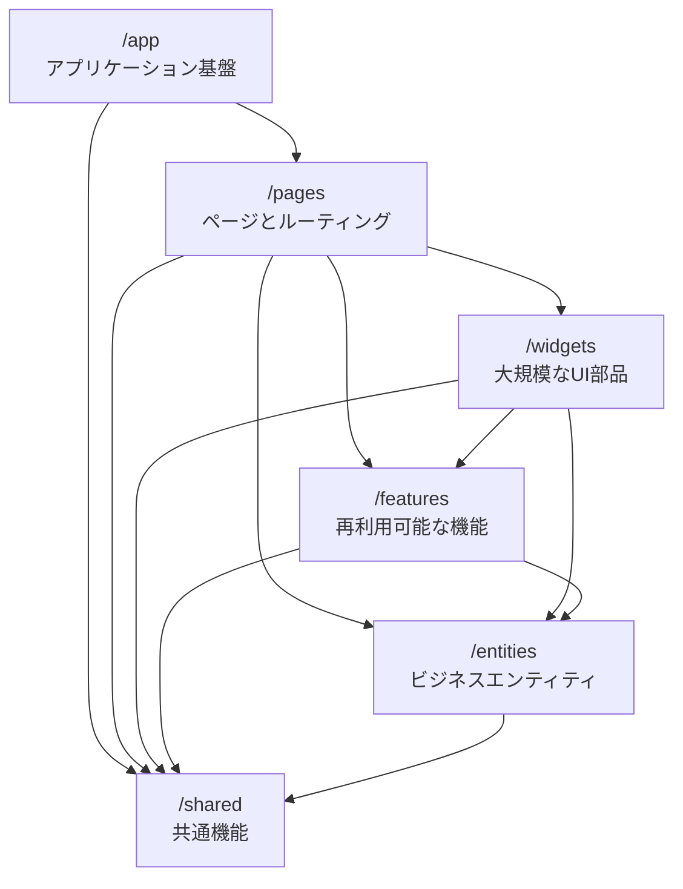

# Feature-Sliced Design (FSD)とは

Feature-Sliced Design (FSD)は、フロントエンドアプリケーションのコードを整理するためのアーキテクチャ手法です。

## 概要

- ビジネス要件が変化する中で、プロジェクトをより理解しやすく安定的に保つことを目的としています。
- フロントエンドアプリケーション(Web、モバイル、デスクトップなど)に適しています。
- 言語、UI フレームワーク、状態管理ライブラリなどの選択に制限はありません。
- 既存のプロジェクトへ段階的に導入することも可能です。



### レイヤー構造

レイヤーは上から下への階層構造を持ち、上位レイヤーは下位レイヤーのみを参照できます：

1. **app/** - アプリケーションの基盤
   - ルーティング設定
   - エントリーポイント
   - グローバルスタイル
   - プロバイダー設定

2. **pages/** - ページとルーティング
   - フルページコンポーネント
   - ネストされたルーティング
   - ページレイアウト

3. **widgets/** - 大規模な UI 部品
   - 独立した機能や UI の集合
   - ユースケース全体を提供
   - 複数のフィーチャーを組み合わせた機能

4. **features/** - 再利用可能な機能
   - ビジネス価値を持つアクション
   - ユーザーストーリーに対応
   - 独立して開発可能

5. **entities/** - ビジネスエンティティ
   - ドメインロジック
   - データモデル
   - 状態管理（Zustand）

6. **shared/** - 共有リソース、 特にプロジェクト/ビジネスの詳細から切り離された機能
   - UI: 基本コンポーネント
   - API: API クライアント
   - lib: ユーティリティ
   - types: 型定義


重要なルール：

- 各レイヤーは、自分より下のレイヤーのみを使用することができます
- App と Shared レイヤーは、他のレイヤーと異なり slice を持たず、直接 segments に分割されます

### スライス(Slice)

レイヤーをビジネスドメインで水平方向に分割したものです。

- 命名は自由で、必要な数だけ作成できます
- 関連するロジックをまとめることで、コードベースのナビゲーションを容易にします
- 同じレイヤー内の他のスライスを使用することはできません

### セグメント(Segment)

スライスを技術的な目的で分割したものです。一般的な命名規則：

- `ui` - UI 表示関連(UI コンポーネント、日付フォーマッタ、スタイルなど)
- `api` - バックエンド連携(リクエスト関数、データ型、マッパーなど)
- `model` - データモデル(スキーマ、インターフェース、ストア、ビジネスロジック)
- `lib` - そのスライスで必要なライブラリコード
- `config` - 設定ファイルやフィーチャーフラグ

## 利点

1. **統一性**

- 構造が標準化されているため、プロジェクトが均一化され、新メンバーのオンボーディングが容易になります

2. **変更とリファクタリングに強い**

- あるレイヤーのモジュールは同じレイヤーや上のレイヤーのモジュールを使用できないため、
  予期しない影響を与えることなく、孤立した変更が可能です

3. **ロジックの再利用制御**

- レイヤーに応じて、コードの再利用性を非常に高くしたり、局所的にしたりできます
- DRY の原則と実用性のバランスを保つことができます

4. **ビジネスとユーザーニーズへの志向**

- アプリケーションがビジネスドメインで分割され、命名にビジネス用語を使用することが推奨されるため、
  プロジェクトの他の部分を完全に理解していなくても、有用なプロダクト開発が可能です

## シンプルなプロジェクト構造例

```
- app/
  - routes/
  - analytics/
- pages/
  - home/
  - article-reader/
    - ui/
    - api/
  - settings/
- shared/
  - ui/
  - api/
```

