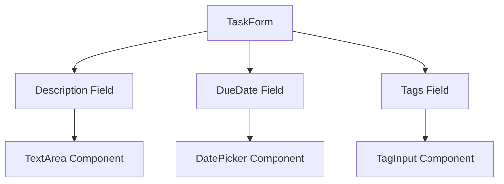
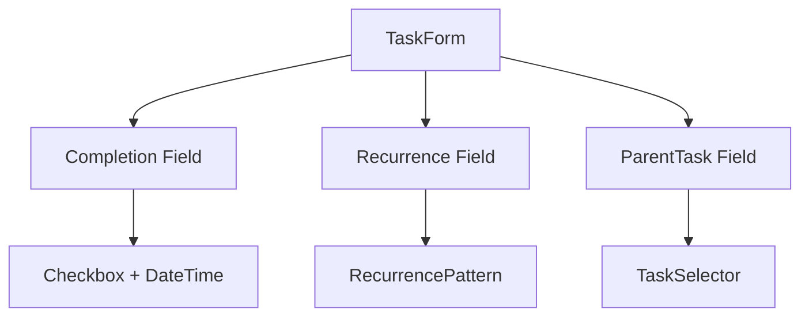

# タスクフォーム実装計画

## 現在の状況

### フェーズ1: 基本フォーム実装（完了）

✅ 実装済みの機能：
- タイトル、ステータス、優先度の入力フォーム
- バリデーション処理とエラー表示
- モーダルUIでのタスク作成
- 楽観的更新とエラー時のロールバック

## フェーズ2: 追加フィールド実装（進行中）

### 実装するフィールド
- description: テキストエリア（任意）
  - TextArea コンポーネントの実装
  - マークダウンプレビュー機能の検討
- dueDate: 日付選択（任意）
  - DatePicker コンポーネントの実装
  - 日付のバリデーション
- tags: 複数選択（任意）
  - タグ入力UIの実装
  - タグの追加/削除機能

### コンポーネント構造

### バリデーションルール
- description
  - 最大1000文字
  - Markdown形式のサポート
- dueDate
  - ISO 8601形式
  - 過去の日付の許可
- tags
  - 最大10個まで
  - 重複の防止
  - 文字数制限（30文字）

### 実装ステップ
1. TextArea コンポーネント
   - [ ] 基本実装
   - [ ] 文字数制限
   - [ ] リサイズ機能
   - [ ] バリデーション

2. DatePicker コンポーネント
   - [ ] カレンダーUIの実装
   - [ ] 日付フォーマット
   - [ ] キーボード操作
   - [ ] バリデーション

3. タグ入力
   - [ ] タグ追加UI
   - [ ] タグ削除機能
   - [ ] バリデーション
   - [ ] 重複チェック

### テスト計画
- [ ] TextArea の入力と検証
- [ ] DatePicker の日付選択
- [ ] タグの追加/削除
- [ ] バリデーションルール
- [ ] エラー表示

## フェーズ3: 高度な機能実装（予定）

### 実装するフィールド
- isCompleted: チェックボックス
  - 完了状態の管理
  - 完了日時の自動設定
- recurrenceRule: 繰り返し設定（任意）
  - 繰り返しパターンの選択
  - カスタム設定
- parentId: 親タスク選択（任意）
  - タスク階層の管理
  - 親タスク選択UI

### コンポーネント設計

### バリデーションルール
- isCompleted
  - 完了時の追加検証
  - サブタスクの状態確認
- recurrenceRule
  - パターンの妥当性
  - 終了日の検証
- parentId
  - 循環参照の防止
  - 深さ制限

### 実装ステップ
1. タスク完了機能
   - [ ] 完了状態の切り替え
   - [ ] サブタスクの処理
   - [ ] 完了日時の管理

2. 繰り返し設定
   - [ ] パターン選択UI
   - [ ] カスタム設定
   - [ ] バリデーション

3. 親タスク選択
   - [ ] タスク検索/選択UI
   - [ ] 階層表示
   - [ ] 循環参照チェック

## 技術的な考慮事項

### パフォーマンス最適化
- コンポーネントの遅延読み込み
- バリデーション処理の最適化
- データ更新の効率化

### アクセシビリティ
- ARIA ラベルとロール
- キーボード操作
- フォーカス管理

### エラーハンドリング
- フィールドレベルのエラー
- フォームレベルのエラー
- API エラー

## 完了条件

### フェーズ2
- [ ] すべての追加フィールドの実装
- [ ] バリデーションの完全な実装
- [ ] テストケースの追加
- [ ] アクセシビリティの確認

### フェーズ3
- [ ] 高度な機能の実装
- [ ] データの整合性チェック
- [ ] パフォーマンステスト
- [ ] E2Eテスト

## 次のステップ

1. TextArea コンポーネントの実装から開始
2. DatePicker の実装
3. タグ入力機能の追加