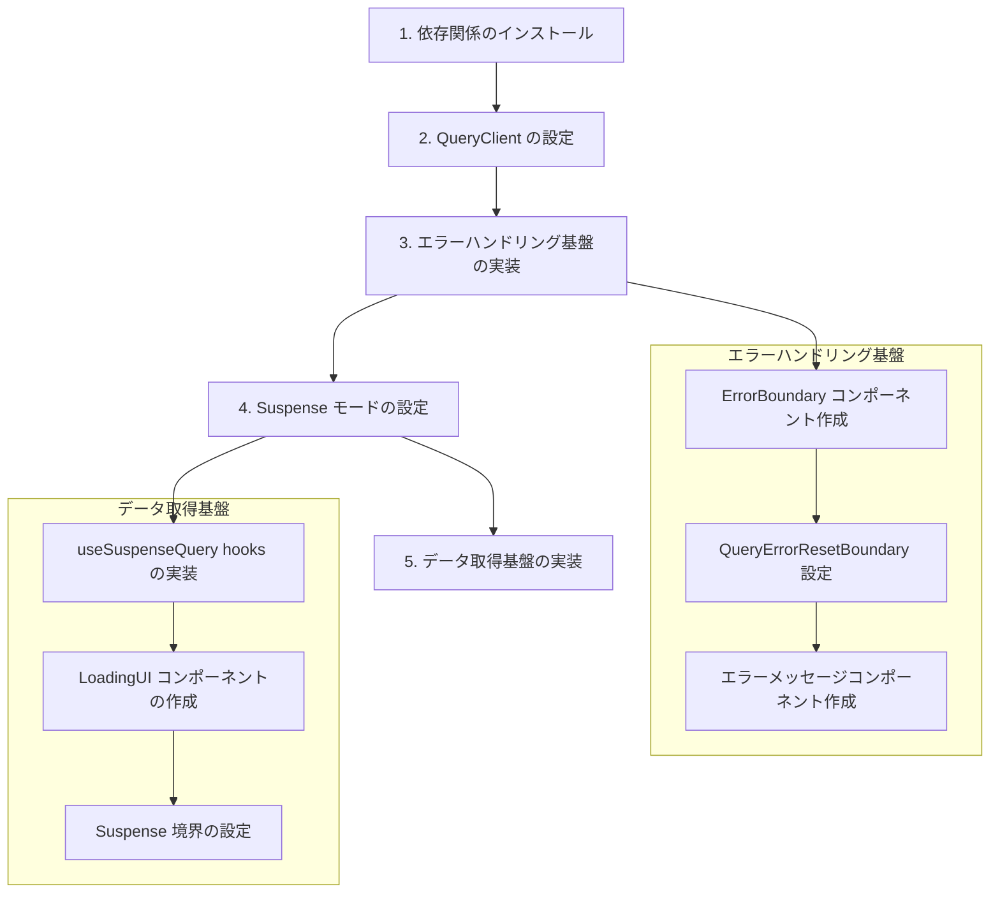

# TanStack Query 実装計画

## 目的
- Suspense モードを活用したデータフェッチング基盤の構築
- エラーハンドリングの統一的な実装
- ローディング状態の適切な管理

## 実装ステップ



### 1. 依存関係のインストール

```bash
pnpm add @tanstack/react-query react-error-boundary
```

### 2. QueryClient の設定

- QueryClient インスタンスの作成
  - デフォルトオプションの設定
  - キャッシュ戦略の定義
- QueryClientProvider の設定
  - アプリケーションのルートでの Provider 設定

### 3. エラーハンドリング基盤

#### ErrorBoundary コンポーネント
- react-error-boundary の利用
- エラー発生時の UI 定義
- リトライ機能の実装

#### QueryErrorResetBoundary
- エラーリセット境界の設定
- エラー状態のリセットロジック

#### エラーメッセージコンポーネント
- エラーメッセージの表示
- ユーザーアクション（リトライなど）の提供

### 4. Suspense モードの設定

- useSuspenseQuery フックの設定
  - 型定義
  - エラーハンドリング
- Suspense 境界の適切な配置
  - コンポーネント階層の設計
  - フォールバック UI の定義

### 5. データ取得基盤

#### データ取得カスタムフック
- 共通のデータ取得ロジック
- エラーハンドリング統合
- 型安全性の確保

#### ローディング UI
- スケルトンローディング
- プログレスインジケータ
- 適切なフォールバック UI

## 技術的な考慮事項

### パフォーマンス
- キャッシュ戦略の最適化
- 不要な再レンダリングの防止
- メモリ使用量の管理

### エラーハンドリング
- ネットワークエラー
- バリデーションエラー
- 予期しないエラー

### 型安全性
- TypeScript の厳密な型チェック
- API レスポンスの型定義
- エラー型の定義

## テスト戦略

### 単体テスト
- カスタムフックのテスト
- エラーハンドリングのテスト
- コンポーネントのテスト

### 統合テスト
- データフェッチングフローのテスト
- エラー状態の検証
- ローディング状態の検証

## 今後の展開

### 機能拡張
- オフライン対応
- 楽観的更新
- リアルタイム更新

### パフォーマンス改善
- プリフェッチング
- キャッシュの最適化
- バンドルサイズの最適化