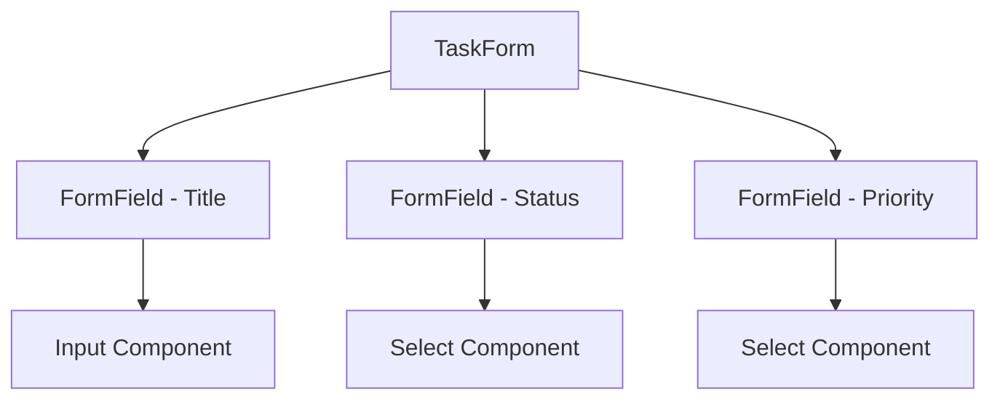

# タスクフォーム実装計画

## 概要

タスク作成フォームをインクリメンタルに実装していく計画です。最小限の機能から始めて、段階的に機能を追加していきます。

## フェーズ1: 基本フォーム実装

### 実装するフィールド
- title: 文字列（必須）
- status: 選択肢
- priority: 選択肢

### 技術スタック
- @tanstack/react-form: フォーム状態管理
- valibot: バリデーション
- shadcn/ui: UIコンポーネント

### コンポーネント構造

### バリデーションルール
- title
  - 必須
  - 1-100文字
  - 前後の空白を除去
- status
  - 必須
  - 定義された値のみ
- priority
  - 必須
  - 定義された値のみ

### エラーハンドリング
- フィールドレベルのバリデーション
- フォームレベルのバリデーション
- API エラーの表示

### テスト計画
- 入力検証
- バリデーションルール
- エラー表示
- 送信処理
- エラーケース

## フェーズ2: 追加フィールド実装

### 実装するフィールド
- description: テキストエリア（任意）
- dueDate: 日付選択（任意）
- tags: 複数選択（任意）

## フェーズ3: 高度な機能実装

### 実装するフィールド
- isCompleted: チェックボックス
- recurrenceRule: 繰り返し設定（任意）
- parentId: 親タスク選択（任意）

## 技術的な考慮事項

### パフォーマンス最適化
- フォームの再レンダリング最適化
- バリデーション処理の効率化
- メモ化の適用

### アクセシビリティ
- キーボードナビゲーション
- スクリーンリーダー対応
- WAI-ARIA 属性の適用

### エラーハンドリング
- バリデーションエラーの表示
- API エラーの表示
- ネットワークエラーの処理

## リスク管理

### 潜在的な問題
1. フォームの複雑性が増加
2. パフォーマンスへの影響
3. バリデーションルールの複雑化

### 軽減策
1. コンポーネントの分割
2. パフォーマンスメトリクスの監視
3. バリデーションルールの段階的な実装

## 完了条件

### フェーズ1
- [ ] 基本フィールドの実装
- [ ] バリデーションの実装
- [ ] エラーハンドリングの実装
- [ ] 基本的なテストの作成
- [ ] アクセシビリティの確認

### フェーズ2
- [ ] 追加フィールドの実装
- [ ] 拡張されたバリデーション
- [ ] テストケースの追加

### フェーズ3
- [ ] 高度な機能の実装
- [ ] E2Eテストの追加
- [ ] パフォーマンステスト