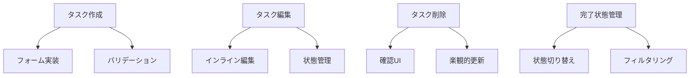

# 現在のコンテキスト

## プロジェクトの現状

現在、プロジェクトは初期設定フェーズにあり、以下の要素が設定済みです：

- Rsbuild による基本的なビルド設定
- Biome によるコード品質管理
- TypeScript の基本設定
- shadcn/ui のベース設定

## 直近の変更

1. Memory Bank の初期化

   - productContext.md: プロジェクトの概要と技術スタック
   - systemPatterns.md: 設計パターンとプラクティス
   - decisionLog.md: アーキテクチャ決定記録
   - progress.md: プロジェクトの進捗状況

2. 実装計画の更新
   - FSD アーキテクチャ構造の定義
   - ErrorBoundary と Suspense パターンの採用
   - データフェッチの実装方針の決定

## 現在の焦点

### タスク操作機能の実装

### 優先度の高いタスク

1. **タスク作成機能の実装**

   - フォームコンポーネントの作成
   - バリデーション実装
   - エラーメッセージの表示
   - 楽観的更新の実装

2. **タスク編集機能の実装**

   - インライン編集UI
   - 編集状態の管理
   - バリデーション
   - キャンセル処理

3. **タスク管理機能の実装**
   - 削除機能
   - 完了状態の切り替え
   - フィルタリング機能
   - ソート機能

## 注意事項とリスク

### 技術的な考慮事項

1. **エラーハンドリング**

   - エラーの種類に応じた適切な処理
   - ユーザーフレンドリーなエラーメッセージ
   - デバッグ情報の適切な管理

2. **パフォーマンス**

   - Suspense による段階的なローディング
   - 適切なキャッシュ戦略
   - バンドルサイズの最適化

3. **ユーザー体験**
   - スムーズなローディング遷移
   - エラー状態からの回復
   - インタラクションのフィードバック

## 次のアクション

### 即時アクション（今日・明日）

1. タスク作成フォームの実装
   - @tanstack/react-form のセットアップ
     - フォームコンテキストの作成
     - 共通フィールドコンポーネントの実装
     - バリデーションスキーマの定義
   - フォームの基本実装
     - タイトル入力フィールド
     - 説明入力フィールド
     - 送信処理の実装
   - フォームのテスト実装
     - バリデーションのテスト
     - 送信処理のテスト
     - エラーハンドリングのテスト

2. インライン編集機能の実装
   - フォーム API の設定
     - フィールド単位のバリデーション
     - オプティミスティックな更新処理
   - UI 実装
     - 編集モードの状態管理
     - バリデーションフィードバック
     - キャンセル処理

### 短期アクション（今週）

1. タスク管理機能の実装

   - 削除機能の実装
   - 確認ダイアログの作成
   - 楽観的更新の実装
   - エラーハンドリング

2. フィルタリング機能の実装
   - フィルターコンポーネントの作成
   - 状態管理の統合
   - ソート機能の追加
   - UI/UX の最適化

### 中期アクション（今月）

1. パフォーマンス最適化

   - メモ化の実装
   - 仮想化の検討
   - バンドルサイズの最適化
   - レンダリング分析

2. テスト拡充
   - E2E テストの追加
   - インテグレーションテストの拡充
   - パフォーマンステストの実装
   - アクセシビリティテストの追加

## 開発環境情報

### 必要な設定

- TanStack Query の Suspense モード
- ErrorBoundary のグローバル設定
- MSW のセットアップ
- テスト環境の構築

### コマンド

- 開発サーバー: `pnpm dev`
- テスト実行: `pnpm test`
- ビルド: `pnpm build`
