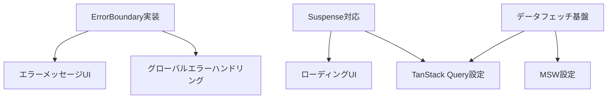

# 現在のコンテキスト

## プロジェクトの現状

現在、プロジェクトは初期設定フェーズにあり、以下の要素が設定済みです：

- Rsbuild による基本的なビルド設定
- Biome によるコード品質管理
- TypeScript の基本設定
- shadcn/ui のベース設定

## 直近の変更

1. Memory Bank の初期化

   - productContext.md: プロジェクトの概要と技術スタック
   - systemPatterns.md: 設計パターンとプラクティス
   - decisionLog.md: アーキテクチャ決定記録
   - progress.md: プロジェクトの進捗状況

2. 実装計画の更新
   - FSD アーキテクチャ構造の定義
   - ErrorBoundary と Suspense パターンの採用
   - データフェッチの実装方針の決定

## 現在の焦点

### エラーハンドリングとデータフェッチの基盤構築

### 優先度の高いタスク

1. **エラーハンドリング基盤の実装**

   - ErrorBoundary コンポーネントの作成
   - エラーメッセージ UI の実装
   - グローバルエラーハンドリングの設定

2. **Suspense 対応の実装**

   - ローディング UI の作成
   - スケルトンローダーの実装
   - 段階的なローディング戦略の確立

3. **TanStack Query の設定**
   - Suspense モードの有効化
   - キャッシュ戦略の定義
   - エラーハンドリングの統合

## 注意事項とリスク

### 技術的な考慮事項

1. **エラーハンドリング**

   - エラーの種類に応じた適切な処理
   - ユーザーフレンドリーなエラーメッセージ
   - デバッグ情報の適切な管理

2. **パフォーマンス**

   - Suspense による段階的なローディング
   - 適切なキャッシュ戦略
   - バンドルサイズの最適化

3. **ユーザー体験**
   - スムーズなローディング遷移
   - エラー状態からの回復
   - インタラクションのフィードバック

## 次のアクション

### 即時アクション（今日・明日）

1. ErrorBoundary の基本実装

   - コンポーネントの作成
   - エラーメッセージ UI の実装
   - テストケースの作成

2. Suspense 対応のセットアップ
   - ローディング UI の実装
   - TanStack Query の設定
   - MSW の初期設定

### 短期アクション（今週）

1. データフェッチの基盤実装

   - API クライアントの作成
   - キャッシュ戦略の実装
   - エラーハンドリングの統合

2. UI コンポーネントの整備
   - 共通コンポーネントの実装
   - スケルトンローダーの作成
   - エラー状態の UI 実装

### 中期アクション（今月）

1. パフォーマンス最適化

   - ローディング戦略の最適化
   - キャッシュ設定の調整
   - バンドルサイズの分析

2. テスト基盤の整備
   - エラーケースのテスト
   - ローディング状態のテスト
   - E2E テストの実装

## 開発環境情報

### 必要な設定

- TanStack Query の Suspense モード
- ErrorBoundary のグローバル設定
- MSW のセットアップ
- テスト環境の構築

### コマンド

- 開発サーバー: `pnpm dev`
- テスト実行: `pnpm test`
- ビルド: `pnpm build`
