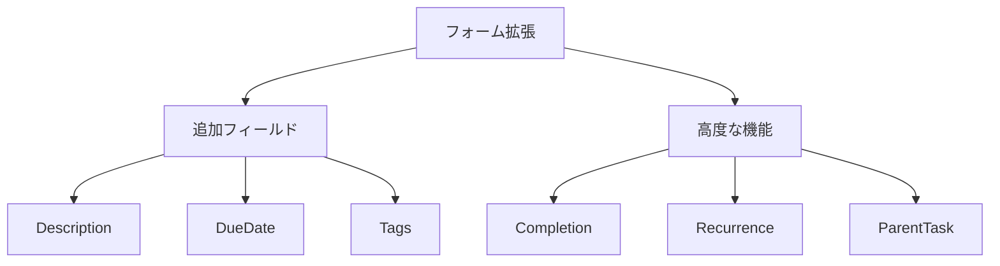
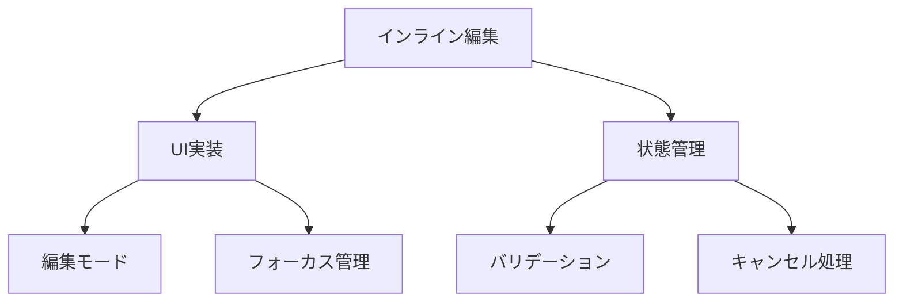

# 現在のコンテキスト

## プロジェクトの現状

プロジェクトは基本機能実装フェーズにあり、以下の要素が実装済みです：

- フォーム基盤の完全な刷新
  - TanStack Form による実装
  - Valibot によるバリデーション
  - 共通コンポーネントの整備
- タスク管理の基本機能
  - タスク作成モーダル
  - タスクリスト表示
  - データフェッチの基盤

## 直近の変更

1. フォーム実装の刷新
   - TanStack Form への完全移行
   - react-hook-form の削除
   - フォームコンテキストの整備
   - 共通フィールドコンポーネントの実装

2. タスク管理機能の実装
   - モーダルベースのタスク作成UI
   - バリデーション処理の実装
   - エラーハンドリングの改善
   - 楽観的更新の準備

## 現在の焦点

### フォーム機能の拡張

### インライン編集機能

## 注意事項とリスク

### 技術的な考慮事項

1. **フォームパフォーマンス**
   - 再レンダリングの最適化
   - バリデーション処理の効率化
   - メモ化戦略の適用

2. **データ整合性**
   - 楽観的更新の信頼性
   - エラー時のロールバック
   - 競合解決の戦略

3. **UX最適化**
   - フィードバックの即時性
   - エラー表示の一貫性
   - アクセシビリティの確保

## 次のアクション

### 即時アクション（今日・明日）

1. タスクフォームの拡張
   - Description フィールドの実装
   - DueDate フィールドの実装
   - Tags フィールドの実装
   - バリデーションの拡張

2. インライン編集の実装
   - 編集モードのUI実装
   - フォーカス管理の実装
   - バリデーション統合
   - キャンセル処理の実装

### 短期アクション（今週）

1. 楽観的更新の完全実装
   - キャッシュ更新ロジック
   - ロールバック処理
   - エラーハンドリング

2. タスク管理機能の拡充
   - 削除機能とUI
   - フィルタリング実装
   - ステータス管理

### 中期アクション（今月）

1. UI/UX の最適化
   - パフォーマンス改善
   - アクセシビリティ対応
   - エラーフィードバック改善

2. テスト拡充
   - フォームテストの追加
   - E2Eテストの実装
   - パフォーマンステスト

## 開発環境情報

### 重要な設定

- TanStack Form のコンテキスト設定
- Valibot のバリデーションスキーマ
- ErrorBoundary の統合
- MSW のハンドラー更新

### コマンド

- 開発サーバー: `pnpm dev`
- テスト実行: `pnpm test`
- ビルド: `pnpm build`
- Storybook: `pnpm storybook`
