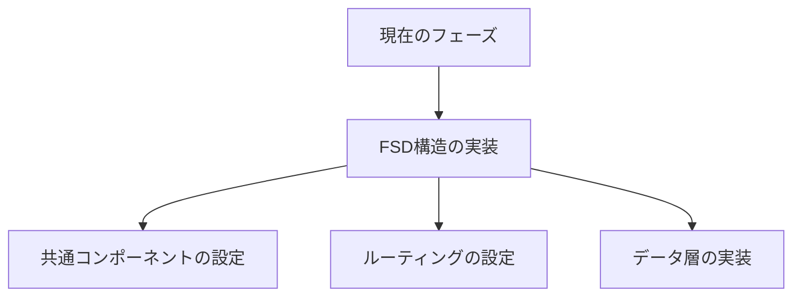

# 現在のコンテキスト

## プロジェクトの現状

現在、プロジェクトは初期設定フェーズにあり、以下の要素が設定済みです：

- Rsbuild による基本的なビルド設定
- Biome によるコード品質管理
- TypeScript の基本設定
- shadcn/ui のベース設定

## 直近の変更

1. Memory Bank の初期化
   - productContext.md: プロジェクトの概要と技術スタック
   - systemPatterns.md: 設計パターンとプラクティス
   - decisionLog.md: アーキテクチャ決定記録
   - progress.md: プロジェクトの進捗状況

## 現在の焦点

### アーキテクチャの実装準備



### 優先度の高いタスク

1. **プロジェクト構造の確立**

   - FSD アーキテクチャに基づくディレクトリ構造の作成
   - 各レイヤーの責務の明確化
   - 依存関係の制御

2. **データ層の基盤構築**

   - MSW の設定と API モックの実装
   - localStorage との連携設計
   - TanStack Query の設定

3. **UI 基盤の整備**
   - shadcn/ui コンポーネントの導入
   - グローバルスタイルの定義
   - テーマ設定の実装

## 注意事項とリスク

### 技術的な考慮事項

1. **型安全性**

   - すべてのコンポーネントで TypeScript の厳格な型チェックを維持
   - API 型定義の整備

2. **パフォーマンス**

   - 早期からのパフォーマンス最適化の考慮
   - バンドルサイズの監視
   - レンダリングパフォーマンスの測定

3. **テスト容易性**
   - テスタブルなコード設計
   - テストカバレッジの目標設定

## 次のアクション

### 即時アクション（今日・明日）

1. FSD ディレクトリ構造の作成

   ```
   src/
   ├── shared/      # 共通ユーティリティ
   ├── entities/    # ドメインモデル
   ├── features/    # 機能実装
   ├── widgets/     # 複合UI
   ├── pages/       # ページコンポーネント
   └── app/         # アプリケーション設定
   ```

2. 基本的なルーティング設定

   - TanStack Router の File-Based Routing の設定
   - 初期ルートの定義

3. データ層の基盤実装
   - MSW のセットアップ
   - 基本的な API モックの作成

### 短期アクション（今週）

1. タスク管理の基本機能実装

   - モデル定義
   - API 実装
   - UI コンポーネント作成

2. テスト基盤の整備
   - Vitest の設定
   - テストユーティリティの作成

### 中期アクション（今月）

1. 高度な機能の実装

   - サブタスク機能
   - 繰り返しタスク機能

2. パフォーマンス最適化
   - バンドル分析
   - パフォーマンス計測

## 開発環境情報

- Node.js バージョン要件
- 必要な環境変数
- 開発用コマンド
