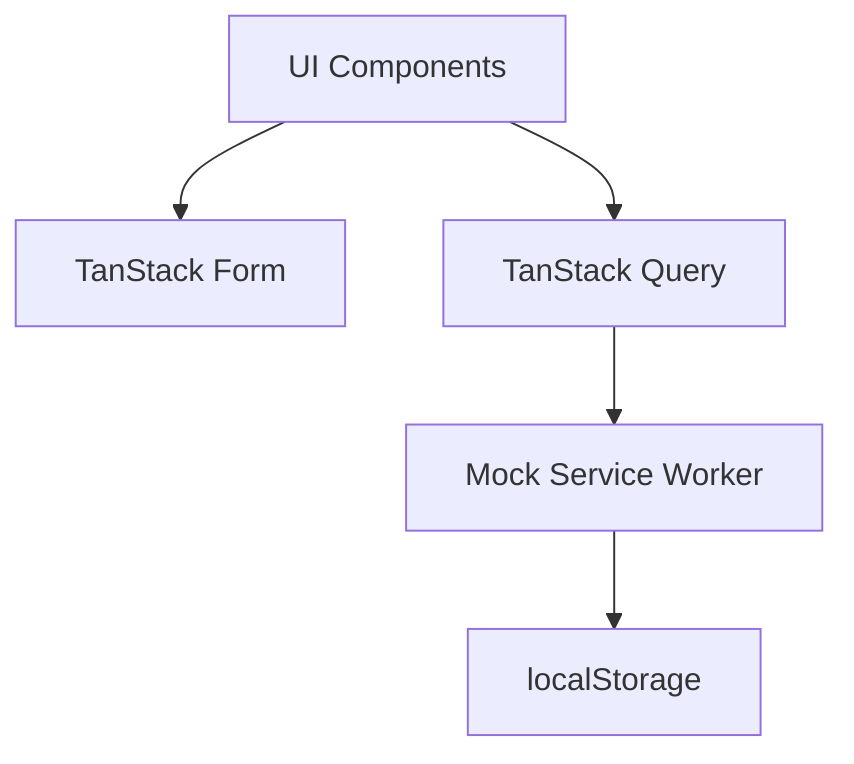

# プロジェクトコンテキスト

## プロジェクト概要

ToDo 管理 Web アプリケーションを構築し、以下の技術スタックの学習を目的としています：

- TanStack Router の File-Based Routing
- TanStack Query
- shadcn/ui

## アーキテクチャ概要

### フロントエンド アーキテクチャ

- **アーキテクチャパターン**: Feature-Sliced Design（FSD）
- **レンダリング**: SPA（クライアントサイドレンダリング）
- **状態管理戦略**:
  - グローバル状態: Zustand
  - サーバー状態: TanStack Query
  - フォーム状態: TanStack Form

### データフロー

### 技術スタック詳細

1. **フロントエンド基盤**

   - React + TypeScript
   - Rsbuild (ビルドツール)

2. **UI レイヤー**

   - shadcn/ui
   - Tailwind CSS
   - Storybook

3. **データ管理**

   - TanStack Query (データフェッチング)
   - Zustand (状態管理)
   - TanStack Form (フォーム管理)

4. **API モック**

   - Mock Service Worker
   - localStorage による永続化

5. **品質保証**
   - Valibot (バリデーション)
   - Vitest + React Testing Library (単体/統合テスト)
   - Playwright (E2E テスト)
   - Biome (リンター)

## 主要機能

### コア機能

- タスクの CRUD 操作
- サブタスク管理
- 繰り返しタスク設定

### ビュー

- リストビュー
- カンバンビュー
- ドラッグ＆ドロップ機能

### 検索・フィルター

- 高度な検索機能
- カスタムフィルター

## 非機能要件

1. **パフォーマンス**

   - 高速なレスポンス
   - 効率的なデータ取得

2. **ユーザビリティ**

   - 直感的な UI
   - キーボードショートカット対応
   - マークダウン記法サポート

3. **保守性**
   - 明確なコード構造
   - 適切なテストカバレッジ
   - エラーハンドリング
