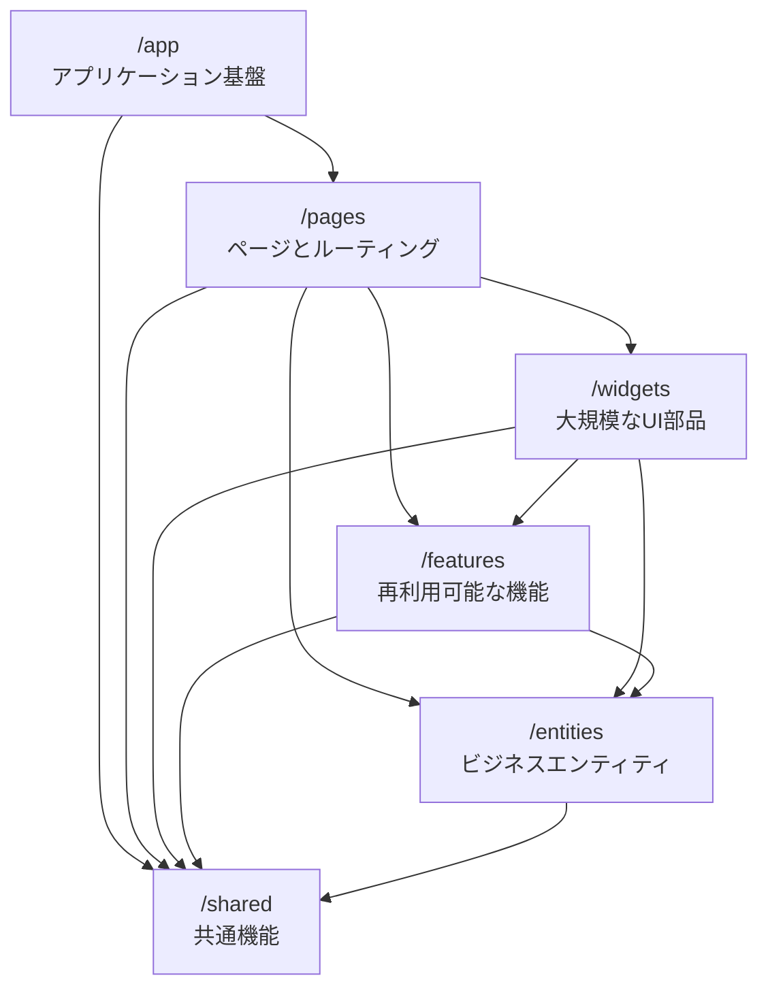

# システムパターンとプラクティス

## アーキテクチャパターン: Feature-Sliced Design (FSD)

Feature-Sliced Design（FSD）はフロントエンドアプリケーションのための体系的なアーキテクチャ手法です。
常に変化するビジネス要件に対して、プロジェクトをより理解しやすく安定的に保つことを目的としています。



### レイヤー構造

レイヤーは上から下への階層構造を持ち、上位レイヤーは下位レイヤーのみを参照できます：

1. **app/** - アプリケーションの基盤
   - ルーティング設定
   - エントリーポイント
   - グローバルスタイル
   - プロバイダー設定

2. **pages/** - ページとルーティング
   - フルページコンポーネント
   - ネストされたルーティング
   - ページレイアウト
   - TanStack Router の設定

3. **widgets/** - 大規模な UI 部品
   - 独立した機能や UI の集合
   - ユースケース全体を提供
   - 複数のフィーチャーを組み合わせた機能

4. **features/** - 再利用可能な機能
   - ビジネス価値を持つアクション
   - ユーザーストーリーに対応
   - 独立して開発可能

5. **entities/** - ビジネスエンティティ
   - ドメインロジック
   - データモデル
   - 状態管理（Zustand）

6. **shared/** - 共有リソース
   - UI: 基本コンポーネント（shadcn/ui）
   - API: API クライアント
   - lib: ユーティリティ
   - types: 型定義

## フォームパターン

### フォーム基盤パターン

```typescript
import { createFormHookContexts } from '@tanstack/react-form'
import { fieldContext, formContext } from '@/shared/lib/form-context'
import * as v from 'valibot'

// フォームコンテキストの作成
const { formContext, fieldContext } = createFormHookContexts()

// バリデーションスキーマの定義
const TaskSchema = v.object({
  title: v.pipe(
    v.string(),
    v.minLength(1, 'タイトルは必須です'),
    v.maxLength(100, 'タイトルは100文字以内で入力してください')
  ),
  description: v.pipe(
    v.string(),
    v.maxLength(1000, '説明は1000文字以内で入力してください')
  ),
  dueDate: v.pipe(
    v.string(),
    v.optional()
  ),
  tags: v.array(v.string()),
})

// フォームフックの作成
export const { useAppForm } = createFormHook({
  fieldComponents: {
    TextField: ({ field, label, description, error }) => (
      <FormField
        label={label}
        description={description}
        error={error}
      >
        <FormControl>
          <Input
            value={field.state.value}
            onChange={e => field.handleChange(e.target.value)}
            onBlur={field.handleBlur}
          />
        </FormControl>
      </FormField>
    ),
    TextareaField: ({ field, label, description, error }) => (
      <FormField
        label={label}
        description={description}
        error={error}
      >
        <FormControl>
          <Textarea
            value={field.state.value}
            onChange={e => field.handleChange(e.target.value)}
            onBlur={field.handleBlur}
          />
        </FormControl>
      </FormField>
    ),
  },
  formContext,
  fieldContext,
})
```

### バリデーションパターン

```typescript
// バリデーションスキーマ
const TaskSchema = v.object({
  title: v.pipe(
    v.string(),
    v.minLength(1, 'タイトルは必須です'),
    v.maxLength(100, 'タイトルは100文字以内で入力してください')
  ),
  description: v.pipe(
    v.string(),
    v.maxLength(1000, '説明は1000文字以内で入力してください')
  ),
  dueDate: v.pipe(
    v.string(),
    v.optional(),
    v.transform(value => value ? new Date(value) : undefined)
  ),
  tags: v.array(
    v.pipe(
      v.string(),
      v.maxLength(30, 'タグは30文字以内で入力してください')
    ),
    v.maxLength(10, 'タグは10個まで設定できます')
  ),
})

// フォームの実装
function TaskForm() {
  const form = useAppForm({
    defaultValues: {
      title: '',
      description: '',
      dueDate: '',
      tags: [],
    },
    onSubmit: async ({ value }) => {
      const result = await submitTask(value)
      // エラーハンドリング
      if (!result.success) {
        return {
          error: result.error,
        }
      }
    },
  })

  return (
    <form
      onSubmit={(e) => {
        e.preventDefault()
        form.handleSubmit()
      }}
    >
      <form.Field
        name="title"
        children={(field) => (
          <field.TextField
            label="タイトル"
            description="タスクのタイトルを入力してください"
          />
        )}
      />

      <form.Field
        name="description"
        children={(field) => (
          <field.TextareaField
            label="説明"
            description="タスクの詳細を入力してください"
          />
        )}
      />
    </form>
  )
}
```

### インライン編集パターン

```typescript
function InlineEditField({
  name,
  label,
  defaultValue,
  onSave,
}: InlineEditFieldProps) {
  const [isEditing, setIsEditing] = useState(false)

  return (
    <form.Field
      name={name}
      defaultValue={defaultValue}
      children={(field) => (
        <div className="inline-field">
          {isEditing ? (
            <field.TextField
              label={label}
              autoFocus
              onBlur={() => {
                setIsEditing(false)
                onSave?.(field.state.value)
              }}
              onKeyDown={(e) => {
                if (e.key === 'Escape') {
                  setIsEditing(false)
                  field.setValue(defaultValue)
                }
              }}
            />
          ) : (
            <div
              onClick={() => setIsEditing(true)}
              role="button"
              tabIndex={0}
            >
              {field.state.value}
            </div>
          )}
        </div>
      )}
    />
  )
}
```

### エラーハンドリングパターン

```typescript
// API エラー型
interface ApiError {
  code: string
  message: string
  fieldErrors?: Record<string, string>
}

// エラーハンドリング
const handleApiError = (error: ApiError) => ({
  error: error.message,
  fieldErrors: error.fieldErrors,
})

// フォームの実装
function TaskForm() {
  const form = useAppForm({
    defaultValues: initialValues,
    onSubmit: async ({ value }) => {
      try {
        await submitTask(value)
      } catch (error) {
        if (error instanceof ApiError) {
          return handleApiError(error)
        }
        throw error
      }
    },
  })

  return (
    <form onSubmit={form.handleSubmit}>
      {/* フォームフィールド */}
      {form.state.error && (
        <div className="error">{form.state.error}</div>
      )}
    </form>
  )
}
```

### 楽観的更新パターン

```typescript
function useOptimisticUpdate() {
  const queryClient = useQueryClient()

  return useMutation({
    mutationFn: updateTask,
    onMutate: async (newTask) => {
      await queryClient.cancelQueries(['tasks'])
      const previousTasks = queryClient.getQueryData(['tasks'])

      queryClient.setQueryData(['tasks'], (old: Task[]) =>
        old.map((task) =>
          task.id === newTask.id ? newTask : task
        )
      )

      return { previousTasks }
    },
    onError: (err, newTask, context) => {
      queryClient.setQueryData(
        ['tasks'],
        context?.previousTasks
      )
    },
    onSettled: () => {
      queryClient.invalidateQueries(['tasks'])
    },
  })
}
```

## テストパターン

### コンポーネントテスト

```typescript
// フォームのテスト
describe('TaskForm', () => {
  it('validates required fields', async () => {
    render(<TaskForm />)
    
    fireEvent.click(screen.getByRole('button', { name: '保存' }))
    
    expect(await screen.findByText('タイトルは必須です')).toBeVisible()
  })

  it('handles successful submission', async () => {
    const onSubmit = vi.fn()
    render(<TaskForm onSubmit={onSubmit} />)
    
    fireEvent.change(screen.getByLabelText('タイトル'), {
      target: { value: 'テストタスク' }
    })
    
    fireEvent.click(screen.getByRole('button', { name: '保存' }))
    
    await waitFor(() => {
      expect(onSubmit).toHaveBeenCalledWith({
        title: 'テストタスク',
        description: '',
        tags: [],
      })
    })
  })
})
```

## パフォーマンスパターン

### メモ化パターン

```typescript
// フィールドコンポーネントのメモ化
const TextField = memo(({ field, label }: FieldProps) => (
  <FormField label={label}>
    <FormControl>
      <Input
        value={field.state.value}
        onChange={e => field.handleChange(e.target.value)}
      />
    </FormControl>
  </FormField>
))

// フォーム状態の監視
const FormStateObserver = () => {
  const formState = useStore(form.store, (state) => ({
    isDirty: state.isDirty,
    isValid: state.isValid,
  }))

  return (
    <div>
      <div>Dirty: {formState.isDirty ? 'Yes' : 'No'}</div>
      <div>Valid: {formState.isValid ? 'Yes' : 'No'}</div>
    </div>
  )
}
```

## アクセシビリティパターン

```typescript
// アクセシブルなフォームフィールド
const AccessibleField = ({ label, error, description, children }) => (
  <div role="group" aria-labelledby={`${label}-label`}>
    <label
      id={`${label}-label`}
      htmlFor={label}
    >
      {label}
    </label>
    {children}
    {description && (
      <div id={`${label}-description`}>{description}</div>
    )}
    {error && (
      <div
        id={`${label}-error`}
        role="alert"
        aria-live="polite"
      >
        {error}
      </div>
    )}
  </div>
)
