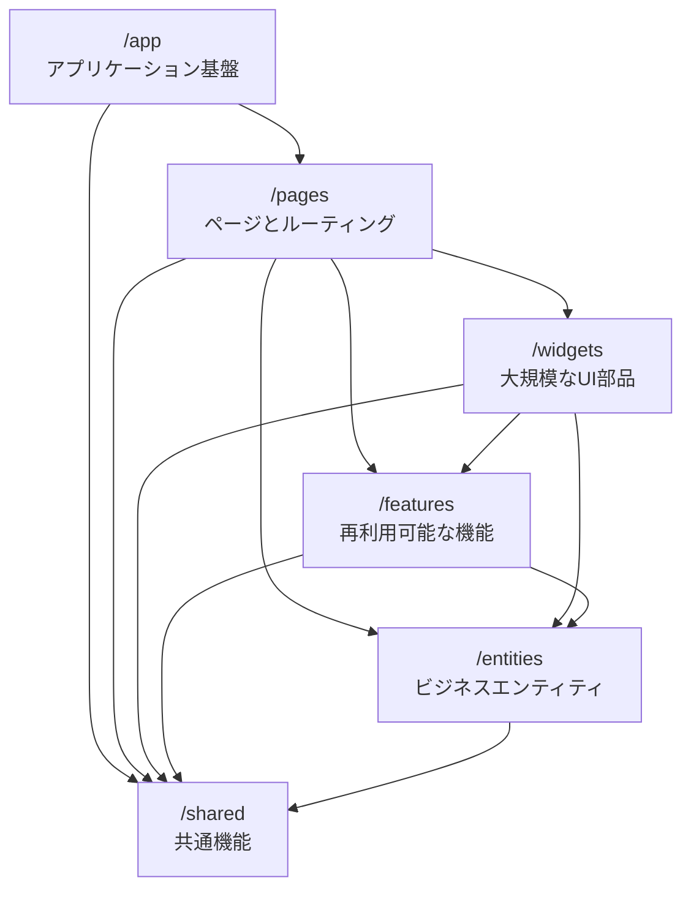

# システムパターンとプラクティス

## アーキテクチャパターン: Feature-Sliced Design (FSD)

Feature-Sliced Design（FSD）はフロントエンドアプリケーションのための体系的なアーキテクチャ手法です。
常に変化するビジネス要件に対して、プロジェクトをより理解しやすく安定的に保つことを目的としています。



### レイヤー構造

レイヤーは上から下への階層構造を持ち、上位レイヤーは下位レイヤーのみを参照できます：

1. **app/** - アプリケーションの基盤
   - ルーティング設定
   - エントリーポイント
   - グローバルスタイル
   - プロバイダー設定

2. **pages/** - ページとルーティング
   - フルページコンポーネント
   - ネストされたルーティング
   - ページレイアウト
   - TanStack Router の設定

3. **widgets/** - 大規模な UI 部品
   - 独立した機能や UI の集合
   - ユースケース全体を提供
   - 複数のフィーチャーを組み合わせた機能

4. **features/** - 再利用可能な機能
   - ビジネス価値を持つアクション
   - ユーザーストーリーに対応
   - 独立して開発可能

5. **entities/** - ビジネスエンティティ
   - ドメインロジック
   - データモデル
   - 状態管理（Zustand）

6. **shared/** - 共有リソース
   - UI: 基本コンポーネント（shadcn/ui）
   - API: API クライアント
   - lib: ユーティリティ
   - types: 型定義

## フォームパターン

### フォーム基盤パターン

```typescript
import { createFormHookContexts } from '@tanstack/react-form'
import { fieldContext, formContext } from '@/shared/lib/form-context'
import * as v from 'valibot'

// フォームコンテキストの作成
const { formContext, fieldContext } = createFormHookContexts()

// バリデーションスキーマの定義
const TaskSchema = v.object({
  title: v.pipe(
    v.string(),
    v.minLength(1, 'タイトルは必須です'),
    v.maxLength(100, 'タイトルは100文字以内で入力してください')
  ),
  description: v.pipe(
    v.string(),
    v.maxLength(1000, '説明は1000文字以内で入力してください')
  ),
  dueDate: v.pipe(
    v.string(),
    v.optional()
  ),
  tags: v.array(v.string()),
})

// フォームフックの作成
export const { useAppForm } = createFormHook({
  fieldComponents: {
    TextField: ({ field, label, description, error }) => (
      <FormField
        label={label}
        description={description}
        error={error}
      >
        <FormControl>
          <Input
            value={field.state.value}
            onChange={e => field.handleChange(e.target.value)}
            onBlur={field.handleBlur}
          />
        </FormControl>
      </FormField>
    ),
    TextareaField: ({ field, label, description, error }) => (
      <FormField
        label={label}
        description={description}
        error={error}
      >
        <FormControl>
          <Textarea
            value={field.state.value}
            onChange={e => field.handleChange(e.target.value)}
            onBlur={field.handleBlur}
          />
        </FormControl>
      </FormField>
    ),
  },
  formContext,
  fieldContext,
})
```

### バリデーションパターン

```typescript
// バリデーションスキーマ
const TaskSchema = v.object({
  title: v.pipe(
    v.string(),
    v.minLength(1, 'タイトルは必須です'),
    v.maxLength(100, 'タイトルは100文字以内で入力してください')
  ),
  description: v.pipe(
    v.string(),
    v.maxLength(1000, '説明は1000文字以内で入力してください')
  ),
  dueDate: v.pipe(
    v.string(),
    v.optional(),
    v.transform(value => value ? new Date(value) : undefined)
  ),
  tags: v.array(
    v.pipe(
      v.string(),
      v.maxLength(30, 'タグは30文字以内で入力してください')
    ),
    v.maxLength(10, 'タグは10個まで設定できます')
  ),
})

// フォームの実装
function TaskForm() {
  const form = useAppForm({
    defaultValues: {
      title: '',
      description: '',
      dueDate: '',
      tags: [],
    },
    onSubmit: async ({ value }) => {
      const result = await submitTask(value)
      // エラーハンドリング
      if (!result.success) {
        return {
          error: result.error,
        }
      }
    },
  })

  return (
    <form
      onSubmit={(e) => {
        e.preventDefault()
        form.handleSubmit()
      }}
    >
      <form.Field
        name="title"
        children={(field) => (
          <field.TextField
            label="タイトル"
            description="タスクのタイトルを入力してください"
          />
        )}
      />

      <form.Field
        name="description"
        children={(field) => (
          <field.TextareaField
            label="説明"
            description="タスクの詳細を入力してください"
          />
        )}
      />
    </form>
  )
}
```

### インライン編集パターン

```typescript
function InlineEditField({
  name,
  label,
  defaultValue,
  onSave,
}: InlineEditFieldProps) {
  const [isEditing, setIsEditing] = useState(false)

  return (
    <form.Field
      name={name}
      defaultValue={defaultValue}
      children={(field) => (
        <div className="inline-field">
          {isEditing ? (
            <field.TextField
              label={label}
              autoFocus
              onBlur={() => {
                setIsEditing(false)
                onSave?.(field.state.value)
              }}
              onKeyDown={(e) => {
                if (e.key === 'Escape') {
                  setIsEditing(false)
                  field.setValue(defaultValue)
                }
              }}
            />
          ) : (
            <div
              onClick={() => setIsEditing(true)}
              role="button"
              tabIndex={0}
            >
              {field.state.value}
            </div>
          )}
        </div>
      )}
    />
  )
}
```

### エラーハンドリングパターン

```typescript
// API エラー型
interface ApiError {
  code: string
  message: string
  fieldErrors?: Record<string, string>
}

// エラーハンドリング
const handleApiError = (error: ApiError) => ({
  error: error.message,
  fieldErrors: error.fieldErrors,
})

// フォームの実装
function TaskForm() {
  const form = useAppForm({
    defaultValues: initialValues,
    onSubmit: async ({ value }) => {
      try {
        await submitTask(value)
      } catch (error) {
        if (error instanceof ApiError) {
          return handleApiError(error)
        }
        throw error
      }
    },
  })

  return (
    <form onSubmit={form.handleSubmit}>
      {/* フォームフィールド */}
      {form.state.error && (
        <div className="error">{form.state.error}</div>
      )}
    </form>
  )
}
```

### 楽観的更新パターン

```typescript
function useOptimisticUpdate() {
  const queryClient = useQueryClient()

  return useMutation({
    mutationFn: updateTask,
    onMutate: async (newTask) => {
      await queryClient.cancelQueries(['tasks'])
      const previousTasks = queryClient.getQueryData(['tasks'])

      queryClient.setQueryData(['tasks'], (old: Task[]) =>
        old.map((task) =>
          task.id === newTask.id ? newTask : task
        )
      )

      return { previousTasks }
    },
    onError: (err, newTask, context) => {
      queryClient.setQueryData(
        ['tasks'],
        context?.previousTasks
      )
    },
    onSettled: () => {
      queryClient.invalidateQueries(['tasks'])
    },
  })
}
```

## テストパターン

### テストの設計原則

1. テストコードの構造化
```typescript
// ❌ 避けるべき：機能を分割したテスト
describe('TaskForm', () => {
  test('初期状態の確認', () => {
    render(<TaskForm />)
    expect(screen.getByLabelText('タイトル')).toBeInTheDocument()
  })

  test('バリデーションの確認', () => {
    render(<TaskForm />)
    fireEvent.click(screen.getByRole('button', { name: '保存' }))
    expect(screen.getByText('タイトルは必須です')).toBeInTheDocument()
  })
})

// ✅ 推奨：ユースケース全体を1つのテストで
test('タスク作成の完全なフロー', async () => {
  const onSubmit = vi.fn()
  render(<TaskForm onSubmit={onSubmit} />)

  // 初期状態の確認
  const titleInput = screen.getByRole('textbox', { name: 'タイトル' })
  expect(titleInput).toBeInTheDocument()

  // バリデーションの確認
  await userEvent.click(screen.getByRole('button', { name: '保存' }))
  expect(screen.getByText('タイトルは必須です')).toBeInTheDocument()

  // 正常系の確認
  await userEvent.type(titleInput, 'テストタスク')
  await userEvent.click(screen.getByRole('button', { name: '保存' }))
  expect(onSubmit).toHaveBeenCalledWith({ title: 'テストタスク' })
})
```

2. テストユーティリティの活用
```typescript
// テストヘルパー関数
function setup(props = {}) {
  const defaultProps = {
    onSubmit: vi.fn(),
    ...props,
  }
  const utils = render(<TaskForm {...defaultProps} />)
  const titleInput = screen.getByRole('textbox', { name: 'タイトル' })
  const submitButton = screen.getByRole('button', { name: '保存' })

  return {
    ...utils,
    titleInput,
    submitButton,
    submitForm: async (title: string) => {
      await userEvent.type(titleInput, title)
      await userEvent.click(submitButton)
    },
  }
}

// テストの実装
test('フォームの送信', async () => {
  const { submitForm } = setup()
  await submitForm('テストタスク')
  expect(screen.getByRole('alert')).toHaveTextContent('保存しました')
})
```

### コンポーネントテスト

1. クエリの優先順位
```typescript
// ✅ 推奨: getByRole と aria-label の使用
const submitButton = screen.getByRole('button', { name: '保存' })
const titleInput = screen.getByRole('textbox', { name: 'タイトル' })

// ❌ 避ける: テストIDの使用
const submitButton = screen.getByTestId('submit-button')
```

2. 非同期処理のテスト
```typescript
test('タスクの読み込みと表示', async () => {
  server.use(
    rest.get('/api/tasks', (req, res, ctx) => {
      return res(ctx.json([{ id: '1', title: 'テスト' }]))
    })
  )

  render(<TaskList />)
  
  // ローディング状態の確認
  expect(screen.getByRole('progressbar')).toBeInTheDocument()
  
  // データ表示の確認
  const task = await screen.findByRole('listitem')
  expect(task).toHaveTextContent('テスト')
})
```

3. エラーケースのテスト
```typescript
test('エラー時の表示', async () => {
  server.use(
    rest.post('/api/tasks', (req, res, ctx) => {
      return res(ctx.status(500))
    })
  )

  const { submitForm } = setup()
  await submitForm('テストタスク')
  
  expect(screen.getByRole('alert')).toHaveTextContent('エラーが発生しました')
})
```

### インテグレーションテスト

```typescript
test('タスクの作成から表示までの統合フロー', async () => {
  render(
    <TaskProvider>
      <TaskList />
      <TaskCreateButton />
    </TaskProvider>
  )

  // 新規タスク作成
  await userEvent.click(screen.getByRole('button', { name: '新規タスク' }))
  
  // モーダルでの入力
  const modal = screen.getByRole('dialog')
  await userEvent.type(
    within(modal).getByRole('textbox', { name: 'タイトル' }),
    'テストタスク'
  )
  await userEvent.click(within(modal).getByRole('button', { name: '保存' }))

  // リストでの表示確認
  expect(await screen.findByRole('listitem')).toHaveTextContent('テストタスク')
})
```

## パフォーマンスパターン

### メモ化パターン

```typescript
// フィールドコンポーネントのメモ化
const TextField = memo(({ field, label }: FieldProps) => (
  <FormField label={label}>
    <FormControl>
      <Input
        value={field.state.value}
        onChange={e => field.handleChange(e.target.value)}
      />
    </FormControl>
  </FormField>
))

// フォーム状態の監視
const FormStateObserver = () => {
  const formState = useStore(form.store, (state) => ({
    isDirty: state.isDirty,
    isValid: state.isValid,
  }))

  return (
    <div>
      <div>Dirty: {formState.isDirty ? 'Yes' : 'No'}</div>
      <div>Valid: {formState.isValid ? 'Yes' : 'No'}</div>
    </div>
  )
}
```

## アクセシビリティパターン

```typescript
// アクセシブルなフォームフィールド
const AccessibleField = ({ label, error, description, children }) => (
  <div role="group" aria-labelledby={`${label}-label`}>
    <label
      id={`${label}-label`}
      htmlFor={label}
    >
      {label}
    </label>
    {children}
    {description && (
      <div id={`${label}-description`}>{description}</div>
    )}
    {error && (
      <div
        id={`${label}-error`}
        role="alert"
        aria-live="polite"
      >
        {error}
      </div>
    )}
  </div>
)
