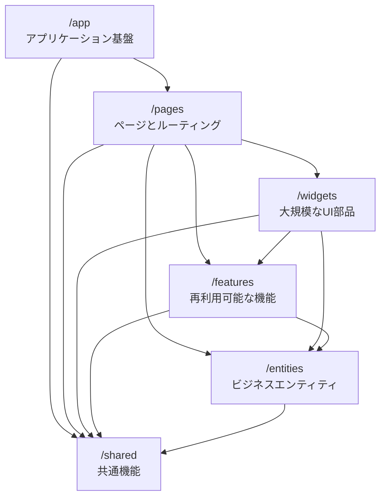

# システムパターンとプラクティス

## アーキテクチャパターン: Feature-Sliced Design (FSD)

Feature-Sliced Design（FSD）はフロントエンドアプリケーションのための体系的なアーキテクチャ手法です。
常に変化するビジネス要件に対して、プロジェクトをより理解しやすく安定的に保つことを目的としています。



### レイヤー構造

レイヤーは上から下への階層構造を持ち、上位レイヤーは下位レイヤーのみを参照できます：

1. **app/** - アプリケーションの基盤

   - ルーティング設定
   - エントリーポイント
   - グローバルスタイル
   - プロバイダー設定

2. **pages/** - ページとルーティング

   - フルページコンポーネント
   - ネストされたルーティング
   - ページレイアウト
   - TanStack Router の設定

3. **widgets/** - 大規模な UI 部品

   - 独立した機能や UI の集合
   - ユースケース全体を提供
   - 複数のフィーチャーを組み合わせた機能

4. **features/** - 再利用可能な機能

   - ビジネス価値を持つアクション
   - ユーザーストーリーに対応
   - 独立して開発可能

5. **entities/** - ビジネスエンティティ

   - ドメインロジック
   - データモデル
   - 状態管理（Zustand）

6. **shared/** - 共有リソース
   - UI: 基本コンポーネント（shadcn/ui）
   - API: GraphQL クライアント
   - lib: ユーティリティ
   - types: 型定義

### スライスとセグメント

#### スライス（ビジネスドメインによる分割）

- 同じレイヤー内の他のスライスを参照できない
- ビジネスドメインに基づいて命名（例：`user`, `product`, `cart`）
- `app`と`shared`レイヤーを除く全レイヤーで必要

#### セグメント（技術的目的による分割）

一般的なセグメント:

- `ui` - UI コンポーネント、スタイル、フォーマッタ
- `api` - バックエンド通信、データ型、マッパー
- `model` - データモデル、スキーマ、ロジック
- `lib` - ライブラリコード
- `config` - 設定ファイル、フィーチャーフラグ

### 設計原則

- レイヤー間の依存関係は下方向のみ
- 同一レイヤー内のスライスは独立
- `app`と`shared`レイヤーはスライスを持たずセグメントで直接分割
- テストはコンポーネントと同じディレクトリに配置

### 段階的な採用戦略

1. まず`app`と`shared`レイヤーを整理して基盤を作る
2. 既存の UI を`widgets`と`pages`に大まかに分配
3. 徐々に依存関係の問題を解決し、`entities`や`features`を抽出

## ルーティングパターン

### TanStack Router の File-Based Routing

TanStack Router は、Next.js のようなファイルベースのルーティングを実現します。

#### ディレクトリ構造

```
src/routes/
├── __root.tsx    # ルートレイアウト
├── index.tsx     # ホームページ
└── about.tsx     # アバウトページ
```

#### 自動生成と型安全性

- `routeTree.gen.ts` が自動生成され、型安全なルーティングを提供
- RSpack プラグインによる自動コード生成
- TypeScript の型定義により、ルートパスの補完とバリデーション

```typescript
// ルートレイアウト (__root.tsx)
export const Route = createRootRoute({
  component: RootComponent,
});

// ページコンポーネント (about.tsx)
export const Route = createFileRoute('/about')({
  component: AboutComponent,
});
```

#### コード分割の自動化

```typescript
// rsbuild.config.ts
TanStackRouterRspack({
  target: 'react',
  autoCodeSplitting: true,
});
```

- 各ルートは自動的に分割されてチャンクに
- ルートごとの遅延ロードを最適化
- ユーザー体験とパフォーマンスを向上

#### ルート定義パターン

1. **ルートレイアウト**

   - 共通のナビゲーション
   - 開発用デバッグツール
   - 共有レイアウト要素

2. **ページコンポーネント**
   - 単一責任の原則に従う
   - データフェッチはコンポーネント内で
   - 必要に応じてネストされたルートをサポート

## コンポーネントパターン

### Suspense によるデータフェッチ

```typescript
// 例: ErrorBoundary
class TodoErrorBoundary extends React.Component<
  { children: React.ReactNode },
  { hasError: boolean }
> {
  constructor(props: { children: React.ReactNode }) {
    super(props);
    this.state = { hasError: false };
  }

  static getDerivedStateFromError(error: Error) {
    return { hasError: true };
  }

  render() {
    if (this.state.hasError) {
      return (
        <ErrorMessage message="タスクの読み込み中にエラーが発生しました" />
      );
    }

    return this.props.children;
  }
}

// 例: TodoList with Suspense
export function TodoList() {
  return (
    <TodoErrorBoundary>
      <Suspense fallback={<LoadingSpinner />}>
        <TodoListContent />
      </Suspense>
    </TodoErrorBoundary>
  );
}

function TodoListContent() {
  const todos = useTodos(); // このフックはSuspenseに対応

  return (
    <ul>
      {todos.map((todo) => (
        <TodoListItem key={todo.id} {...todo} />
      ))}
    </ul>
  );
}

// Suspense対応のデータフェッチフック
function useTodos() {
  return useQuery({
    queryKey: ['todos'],
    queryFn: fetchTodos,
    suspense: true, // Suspenseモードを有効化
  }).data;
}
```

## データ管理パターン

### TanStack Query パターン

```typescript
// カスタムフック
export function useTodos() {
  return useQuery({
    queryKey: ['todos'],
    queryFn: fetchTodos,
    // エラー時の再試行
    retry: 3,
    // キャッシュ時間
    staleTime: 5 * 60 * 1000,
  });
}
```

### Zustand ストアパターン

```typescript
interface TodoStore {
  filter: TodoFilter;
  setFilter: (filter: TodoFilter) => void;
}

export const useTodoStore = create<TodoStore>((set) => ({
  filter: 'all',
  setFilter: (filter) => set({ filter }),
}));
```

## エラーハンドリングパターン

### API エラーハンドリング

```typescript
class ApiError extends Error {
  constructor(message: string, public status: number, public code: string) {
    super(message);
  }
}

async function handleApiError(error: unknown) {
  if (error instanceof ApiError) {
    switch (error.status) {
      case 401:
        // 認証エラー処理
        break;
      case 403:
        // 認可エラー処理
        break;
      default:
      // その他のエラー処理
    }
  }
}
```

### バリデーションパターン

```typescript
import { object, string, boolean } from 'valibot';

const TodoSchema = object({
  id: string(),
  title: string([
    minLength(1, 'Title is required'),
    maxLength(100, 'Title is too long'),
  ]),
  completed: boolean(),
});
```

## テストパターン

### コンポーネントテスト

```typescript
// 例: TodoList.test.tsx
describe('TodoList', () => {
  it('renders todos correctly', () => {
    render(<TodoList todos={mockTodos} />);
    expect(screen.getByText('Test Todo')).toBeInTheDocument();
  });

  it('handles empty state', () => {
    render(<TodoList todos={[]} />);
    expect(screen.getByText('No todos found')).toBeInTheDocument();
  });
});
```

### E2E テストパターン

```typescript
// 例: todo.spec.ts
test('user can create a new todo', async ({ page }) => {
  await page.goto('/');
  await page.fill('[data-testid="todo-input"]', 'New Todo');
  await page.click('[data-testid="add-todo"]');
  await expect(page.locator('text=New Todo')).toBeVisible();
});
```

## セキュリティパターン

### XSS 防止

- React の自動エスケープ機能を活用
- ユーザー入力のバリデーション
- Content Security Policy (CSP) の実装

### CSRF 対策

- API リクエストに CSRF トークンを含める
- SameSite Cookie 属性の使用

## パフォーマンスパターン

### Code Splitting

```typescript
const TodoList = lazy(() => import('./TodoList'));
```

### 仮想化

```typescript
import { useVirtualizer } from '@tanstack/react-virtual';

function VirtualTodoList({ todos }) {
  const rowVirtualizer = useVirtualizer({
    count: todos.length,
    getScrollElement: () => parentRef.current,
    estimateSize: () => 45,
  });

  return (/* 実装 */);
}
```
